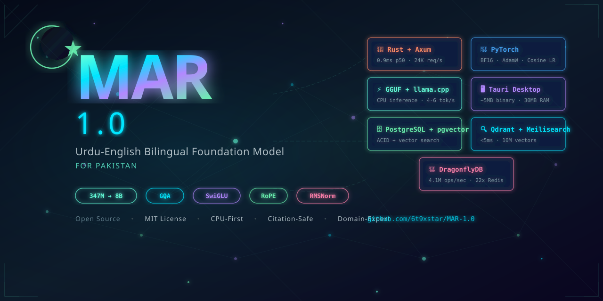

# MAR 1.0

**The fastest, most helpful AI assistant built for Pakistan — open-source, bilingual (Urdu/English), and CPU-friendly.**

[](LICENSE)
[](https://www.rust-lang.org)
[](https://python.org)
[](https://solidjs.com)
[](CONTRIBUTING.md)

---

<p align="center">
  
</p>

## Overview

MAR 1.0 is both a **foundation model architecture** and a **full-stack AI assistant platform**:

- **Model**: A 347M–8B parameter decoder-only transformer with GQA, SwiGLU, RoPE, RMSNorm
- **Training**: PyTorch pipeline for pretraining, from scratch or continued from existing models
- **Inference**: CPU-first via GGUF + llama.cpp (`llama-cpp-2` Rust crate) or Ollama sidecar
- **Desktop**: Tauri 2.x desktop shell with SolidJS frontend (3-10MB binary, 30MB idle RAM)
- **API**: Axum REST server with OpenAI-compatible chat endpoints

### Architecture

```
┌─────────────────────────────────────────────────────────────┐
│                    SolidJS Frontend (Tauri)                   │
│              Signals · No VDOM · Fine-grained reactivity     │
├─────────────────────────────────────────────────────────────┤
│                     Tauri Rust Shell                          │
│                 OS native webview · ~5MB binary              │
├─────────────────────────────────────────────────────────────┤
│                    Axum API Server (Rust)                     │
│             0.9ms p50 · 24,600 req/s · ~3MB idle            │
├──────────┬──────────────────┬────────────────────────────────┤
│ llama.cpp│  Qdrant Vector DB│  DragonflyDB Cache             │
│ GGUF CPU │  (Rust, <5ms)    │  (22x Redis throughput)        │
│ inference│  PostgreSQL+Vec   │  Meilisearch Search            │
└──────────┴──────────────────┴────────────────────────────────┘
```

## Quick Start

### Prerequisites

- Rust 1.81+ (`rustup install 1.81.0`)
- Node.js 20+ and npm
- Python 3.10+ (for training)
- Docker Desktop (for production infrastructure)

### 1. Clone and setup

```bash
git clone https://github.com/6t9xstar/MAR-1.0.git
cd MAR-1.0
cp .env.example .env
```

### 2. Frontend

```bash
npm install
npm run dev          # Vite dev server on :1420
```

### 3. Rust API server (with Ollama)

```bash
# Terminal 1: Start Ollama with a model
ollama pull llama3.1:8b
ollama serve

# Terminal 2: Start the API server
cargo run -p api-server
```

The API server will be available at `http://localhost:8080` with OpenAPI docs at `/api/docs`.

### 4. Desktop app

```bash
npm run tauri:dev
```

## Model Training (Phase 1A)

### Setup Python environment

```bash
cd training
pip install -r requirements.txt
```

### Train tokenizer

```bash
python tokenizer/train_tokenizer.py \
    --output-dir tokenizer/mar_32k \
    --vocab-size 32768
```

### Prepare data

```bash
python data/prepare_fineweb.py \
    --output-dir data/fineweb_raw \
    --sample-size 100000
```

### Train 350M model

```bash
python train.py \
    --config configs/350m.yaml \
    --data-dir data/fineweb_raw \
    --tokenizer-path tokenizer/mar_32k
```

### Export to GGUF

```bash
python convert_to_gguf.py \
    --model-path checkpoints/mar_350m/final
```

Follow the printed instructions to convert with `llama.cpp` convert.py, then serve with the `inference` crate:

```bash
cd ..
# Set MODEL_PATH in inference/.env
cargo run -p inference
```

## Project Structure

```
MAR-1.0/
├── api-server/       # Rust Axum API server
├── training/         # Python model training pipeline
│   ├── model/        # Transformer architecture (MARConfig, MARForCausalLM)
│   ├── tokenizer/    # BPE tokenizer trainer
│   ├── configs/      # Model configuration YAMLs
│   └── tests/        # Unit tests for model + tokenizer
├── src/              # SolidJS frontend
├── src-tauri/        # Tauri desktop shell (Rust)
├── inference/        # llama.cpp GGUF inference server (Rust)
├── data-pipeline/    # Knowledge ingestion pipeline (Rust)
└── deploy/           # Dockerfiles + nginx config
```

## Tech Stack

| Layer | Technology | Performance |
|-------|-----------|-------------|
| Desktop | Tauri 2.x (Rust) | ~5MB binary, 30-60MB RAM |
| Frontend | SolidJS 1.9 | ~7KB gzip, no VDOM |
| API Server | Axum (Rust) | 0.9ms p50, 24,600 req/s |
| Inference | llama.cpp GGUF (Rust) | CPU-first, 4-6 tok/s on 8B Q4 |
| Vector DB | Qdrant (Rust) | <5ms p95 at 10M vectors |
| Cache | DragonflyDB | 4.1M ops/sec |
| Database | PostgreSQL + pgvector | ACID + vector search |
| Full-text | Meilisearch (Rust) | <50ms on 10M docs |

## Development

### Linux / macOS

```bash
# Terminal 1: Infrastructure
docker compose up -d postgres dragonfly qdrant meilisearch

# Terminal 2: API server
cargo run -p api-server

# Terminal 3: Frontend
npm run dev
```

### Windows

```powershell
# Use the dev script
.\scripts\dev.ps1 -All
```

## License

This project is licensed under the MIT License — see [LICENSE](LICENSE).

## Contributors

- **Malik Taimoor Awan** — creator and maintainer ([@yours._malik](https://instagram.com/yours._malik))

Built with ❤️ from Pakistan.
