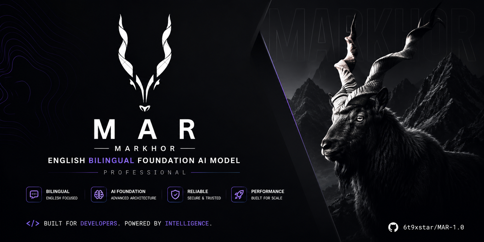

<div align="center">



# MAR 1.0

### Markhor AI — Bilingual Foundation Model & AI Platform

**An open-source, CPU-friendly AI foundation model and full-stack assistant platform built from Pakistan.**

Built for developers. Designed for efficient local inference.  
Powered by **Rust · Python · SolidJS · Tauri · llama.cpp**

<br>

[](LICENSE)
[](https://www.rust-lang.org/)
[](https://www.python.org/)
[](https://www.solidjs.com/)
[](https://tauri.app/)
[](CONTRIBUTING.md)

</div>

---

## 🐐 What is MAR?

**MAR** stands for **Markhor** — inspired by Pakistan's national animal.

MAR 1.0 is an open-source project combining a **decoder-only transformer architecture**, **model-training pipeline**, **local inference engine**, **Rust API backend**, and **cross-platform desktop AI assistant** into one ecosystem.

The goal is straightforward:

> Build an efficient AI platform that can be trained, deployed, extended, and run locally without requiring massive infrastructure.

MAR is being designed around three principles:

**Open. Efficient. Developer-first.**

---

## ✨ Highlights

| | Capability | Description |
|---|---|---|
| 🧠 | **Foundation Model** | Decoder-only transformer architecture scaling from ~347M toward multi-billion parameter configurations |
| ⚡ | **CPU-First Inference** | GGUF-based local inference through llama.cpp |
| 🦀 | **Rust Backend** | High-performance API and inference infrastructure |
| 🖥️ | **Native Desktop** | Lightweight Tauri 2.x application with SolidJS |
| 🔬 | **Trainable** | PyTorch pipeline for tokenizer training, pretraining and experimentation |
| 🔌 | **OpenAI-Compatible API** | Familiar chat-completions style API integration |
| 🔎 | **RAG Ready** | Vector search, PostgreSQL, caching and full-text retrieval infrastructure |
| 🌐 | **Open Source** | MIT licensed and built for community experimentation |

---

# 🧠 Model Architecture

MAR uses a modern decoder-only Transformer architecture.

```text
Input Tokens
     │
     ▼
┌──────────────────────┐
│   Token Embeddings   │
└──────────┬───────────┘
           │
           ▼
┌──────────────────────┐
│  Transformer Block   │ × N
│                      │
│  RMSNorm             │
│      ↓               │
│  GQA + RoPE          │
│      ↓               │
│  Residual             │
│      ↓               │
│  RMSNorm             │
│      ↓               │
│  SwiGLU FFN          │
│      ↓               │
│  Residual             │
└──────────┬───────────┘
           │
           ▼
┌──────────────────────┐
│     Final RMSNorm    │
└──────────┬───────────┘
           │
           ▼
┌──────────────────────┐
│       LM Head        │
└──────────┬───────────┘
           │
           ▼
       Next Token
```

### Core components

- **GQA** — Grouped Query Attention
- **RoPE** — Rotary Position Embeddings
- **SwiGLU** — gated feed-forward network
- **RMSNorm** — efficient normalization
- **Causal Attention** — autoregressive generation
- **BPE Tokenizer** — configurable vocabulary
- **GGUF Export** — optimized local deployment

---

# 🏗️ Platform Architecture

```text
┌───────────────────────────────────────────────────────────────┐
│                        MAR DESKTOP                            │
│                                                               │
│                  SolidJS + TypeScript                         │
│             Fine-grained reactive interface                  │
├───────────────────────────────────────────────────────────────┤
│                        TAURI 2.x                              │
│                                                               │
│                  Native Rust Desktop Shell                    │
├───────────────────────────────────────────────────────────────┤
│                       AXUM API                                │
│                                                               │
│            REST API · Chat · Streaming · Health              │
├─────────────────┬─────────────────┬───────────────────────────┤
│                 │                 │                           │
│    llama.cpp    │     Qdrant      │       Dragonfly          │
│                 │                 │                           │
│  GGUF Inference │  Vector Search  │         Cache             │
│                 │                 │                           │
├─────────────────┴─────────────────┴───────────────────────────┤
│                                                               │
│          PostgreSQL + pgvector · Meilisearch                 │
│                                                               │
└───────────────────────────────────────────────────────────────┘
```

---

# 🚀 Quick Start

## Prerequisites

Make sure you have:

- **Rust 1.81+**
- **Node.js 20+**
- **npm**
- **Python 3.10+** for model training
- **Docker Desktop** for infrastructure services
- **Ollama** or a compatible GGUF runtime for local models

---

## 1. Clone MAR

```bash
git clone https://github.com/6t9xstar/MAR-1.0.git
cd MAR-1.0
cp .env.example .env
```

---

## 2. Start the frontend

```bash
npm install
npm run dev
```

Vite will start the development frontend on:

```text
http://localhost:1420
```

---

## 3. Start MAR with Ollama

Start a local model:

```bash
ollama pull llama3.1:8b
ollama serve
```

Then, in another terminal:

```bash
cargo run -p api-server
```

MAR's API will be available at:

```text
http://localhost:8080
```

OpenAPI documentation:

```text
http://localhost:8080/api/docs
```

---

## 4. Launch the desktop application

```bash
npm run tauri:dev
```

This starts the full MAR desktop experience.

---

# 🔬 Training MAR

MAR includes a PyTorch-based training pipeline for experimenting with and training decoder-only language models.

## Create the environment

```bash
cd training

python -m venv .venv
```

### Linux / macOS

```bash
source .venv/bin/activate
```

### Windows

```powershell
.venv\Scripts\Activate.ps1
```

Install dependencies:

```bash
pip install -r requirements.txt
```

---

## Train the tokenizer

```bash
python tokenizer/train_tokenizer.py \
    --output-dir tokenizer/mar_32k \
    --vocab-size 32768
```

---

## Prepare training data

```bash
python data/prepare_fineweb.py \
    --output-dir data/fineweb_raw \
    --sample-size 100000
```

---

## Train MAR 350M

```bash
python train.py \
    --config configs/350m.yaml \
    --data-dir data/fineweb_raw \
    --tokenizer-path tokenizer/mar_32k
```

---

# 📦 GGUF Export

Export the trained checkpoint:

```bash
python convert_to_gguf.py \
    --model-path checkpoints/mar_350m/final
```

After conversion, configure the model path for the inference service and run:

```bash
cd ..
cargo run -p inference
```

This enables MAR to serve quantized models through its Rust inference layer.

---

# 📂 Repository Structure

```text
MAR-1.0/
│
├── api-server/          # Axum REST API
│
├── training/            # Model training system
│   ├── model/           # MAR transformer architecture
│   ├── tokenizer/       # BPE tokenizer
│   ├── configs/         # Model configurations
│   ├── data/            # Dataset preparation
│   └── tests/           # Training/model tests
│
├── inference/           # GGUF / llama.cpp inference
│
├── data-pipeline/       # Knowledge ingestion & processing
│
├── src/                 # SolidJS frontend
│
├── src-tauri/           # Tauri desktop application
│
├── deploy/              # Deployment configuration
│
├── scripts/             # Development utilities
│
├── docker-compose.yml
├── Cargo.toml
├── package.json
└── README.md
```

---

# 🛠️ Technology

| Layer | Technology |
|---|---|
| 🧠 Model | PyTorch |
| 🔤 Tokenizer | BPE |
| ⚡ Inference | llama.cpp + GGUF |
| 🦀 Backend | Rust + Axum |
| 🖥️ Desktop | Tauri 2.x |
| 🎨 Frontend | SolidJS + TypeScript |
| 🗄️ Database | PostgreSQL |
| 🧬 Vector Search | pgvector + Qdrant |
| ⚡ Cache | Dragonfly |
| 🔎 Search | Meilisearch |
| 📦 Infrastructure | Docker |

---

# 💻 Development

### Linux / macOS

Start infrastructure:

```bash
docker compose up -d postgres dragonfly qdrant meilisearch
```

Start the API:

```bash
cargo run -p api-server
```

Start the frontend:

```bash
npm run dev
```

### Windows

```powershell
.\scripts\dev.ps1 -All
```

---

# 🗺️ Roadmap

MAR is under active development.

```text
MAR 1.0
 │
 ├── Foundation Architecture
 │     ├── Transformer implementation
 │     ├── GQA
 │     ├── RoPE
 │     ├── SwiGLU
 │     └── RMSNorm
 │
 ├── Training
 │     ├── BPE tokenizer
 │     ├── Dataset pipeline
 │     ├── Pretraining
 │     └── Evaluation
 │
 ├── Inference
 │     ├── GGUF
 │     ├── llama.cpp
 │     ├── Quantization
 │     └── CPU optimization
 │
 ├── Platform
 │     ├── Rust API
 │     ├── Desktop app
 │     ├── RAG
 │     └── OpenAI-compatible API
 │
 └── Future
       ├── Larger MAR checkpoints
       ├── Improved bilingual capabilities
       ├── Tool calling
       ├── Multimodal research
       └── Distributed inference
```

---

# 🤝 Contributing

MAR is open to developers, researchers, students, and AI enthusiasts.

Contributions are welcome in areas including:

- Model architecture
- Training infrastructure
- Dataset preparation
- Rust performance
- Local inference
- Desktop UI
- Documentation
- Testing
- Evaluation

Read [`CONTRIBUTING.md`](CONTRIBUTING.md) before submitting a pull request.

---

# 🔐 Security

Found a security issue?

Please avoid opening a public issue containing vulnerability details.

See [`SECURITY.md`](SECURITY.md) for responsible disclosure instructions.

---

# 📜 License

MAR 1.0 is released under the **MIT License**.

See [`LICENSE`](LICENSE) for details.

---

# 👨‍💻 Creator

**Malik Taimoor Awan**

Creator & Maintainer of **MAR — Markhor AI**

[](https://github.com/6t9xstar)
[](https://instagram.com/yours._malik)

---

<div align="center">

## 🐐 MAR

### Markhor AI

**Built from Pakistan 🇵🇰 · Built for Developers 🌍**

Open source. Local first. Built to evolve.

<br>

⭐ **Star MAR if you believe powerful AI should be open and accessible.**

</div>
